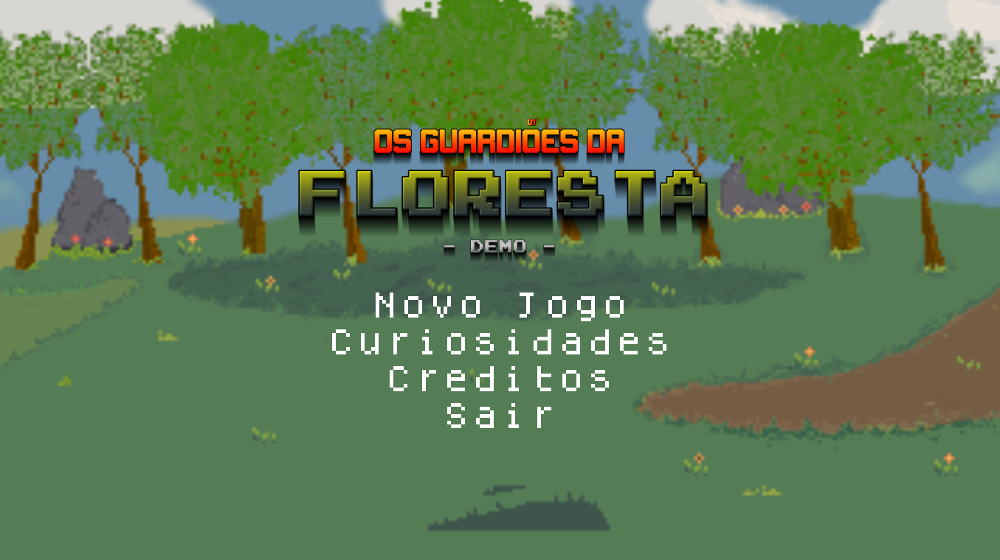
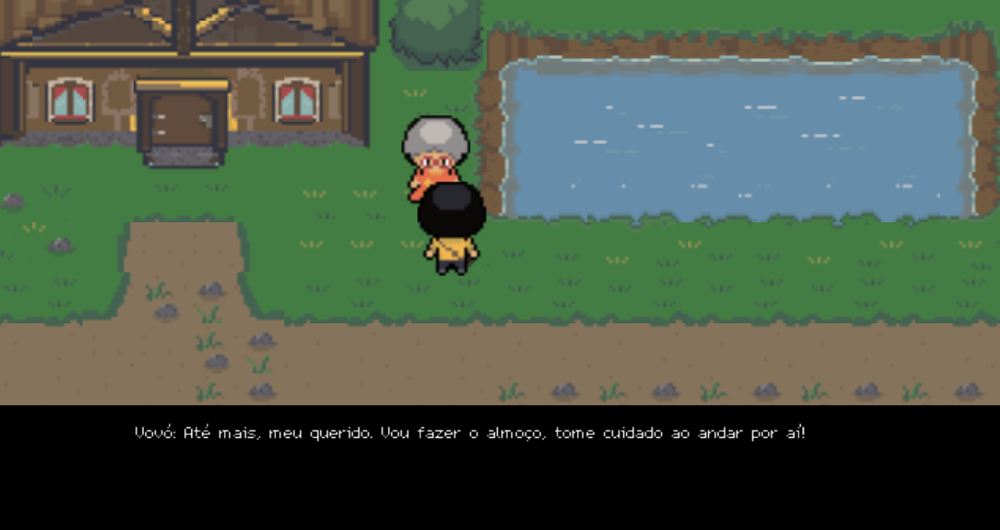
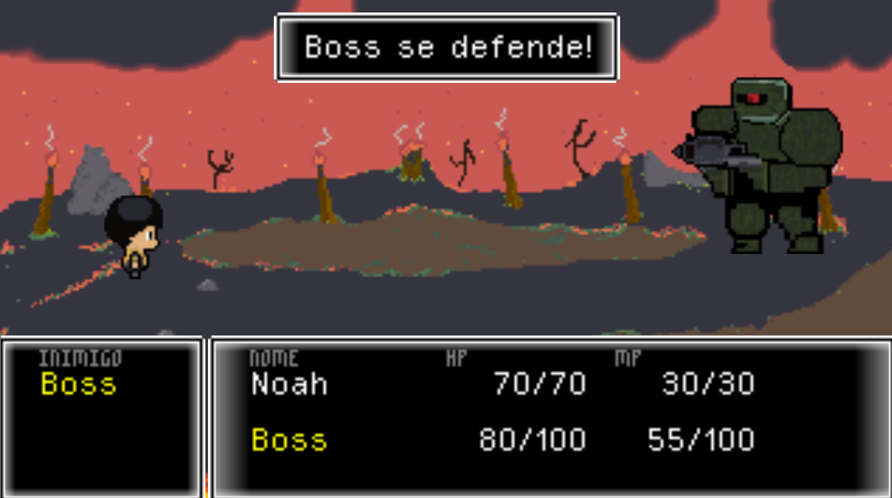

# 🌳 Os Guardiões da Floresta — DEMO

**Projeto de Extensão Escolar — SENAI Félix Guisard | 2024**  

---

## 📌 Sobre o Projeto

**Os Guardiões da Floresta** é um projeto de jogo folclórico desenvolvido como extensão na Escola SENAI Félix Guisard em 2024. O objetivo do game é destacar a cultura dos **Ribeirinhos da Amazônia**, um grupo brasileiro ainda pouco representado, e conscientizar os jogadores sobre a prevenção de queimadas e a importância da educação ambiental.

No jogo você controla Noah, eu garoto destemido que quer salvar a floresta e com a ajuda de personagens do folclore brasileiro que se tornam protetores da floresta, combatendo incêndios e preservando o meio ambiente.

---

## 🎮 Funcionalidades

- Exploração de cenário em **pixel art**
- Personagens baseados no folclore nacional
- Sistema de combate por turnos estilo pokémon, final fantasy e etc
- Missão de conscientização ambiental
- Sistema de Diálogos e Boss Fight

---

## 📸 Demonstrações

### 📺 Tela Inicial do Jogo

### 🎮 Gameplay

### 🐍 Batalha Contra o Boss

---

## 📎 Link do jogo na Itch.io

👉 [Os Guardiões da Floresta no Itch.io](https://rinzura.itch.io/os-guardioes-da-floresta-demo)

---

## 📄 Licença

Este projeto é de caráter educativo e acadêmico. Os direitos sobre o código-fonte, imagens e trilha sonora são reservados à equipe desenvolvedora.

> **Nenhum código-fonte ou arquivo executável está disponibilizado neste repositório.**  
> Este espaço é destinado à documentação e divulgação pública do projeto.

---

## 📬 Créditos

📜 Equipe de Desenvolvimento

Giovanna Felício — Líder de Projeto, Idealizadora e Programadora

Leandro Augusto — Roteirista e Responsável pela Narrativa

Lucas Silva — Programador de Sistemas e Mecânicas

Rodrigo Vilalta — Designer de Ambientação, Artista Conceitual, Compositor de Trilha Sonora e Designer de Efeitos Sonoros

Talita Fagundes — Diretora de Arte, Animação e Ambientação Visual.
